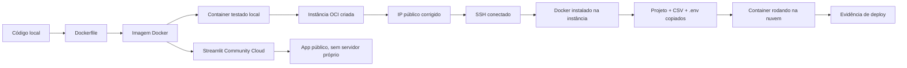

<div align="center">

# wmsbox-agent — Deploy com Docker e Oracle Cloud

### Guia completo de como o agente foi empacotado e colocado para rodar em uma instância na nuvem

[](https://www.docker.com/)
[](https://www.oracle.com/cloud/free/)
[](https://wmsbox-agent-irc5h9jspgid78r7y4yjkz.streamlit.app)

</div>

---

## Índice

- [Por Que Este Documento Existe](#motivacao)
- [Visão Geral do Fluxo](#visao-geral)
- [Parte 1 — Empacotando com Docker](#parte1)
- [Parte 2 — Testando o Container Localmente](#parte2)
- [Parte 3 — Criando a Instância na Oracle Cloud](#parte3)
- [Parte 4 — Corrigindo o IP Público](#parte4)
- [Parte 5 — Conectando via SSH](#parte5)
- [Parte 6 — Instalando o Docker na Instância](#parte6)
- [Parte 7 — Levando o Projeto para a Instância](#parte7)
- [Parte 8 — Rodando o Container na Nuvem](#parte8)
- [Parte 9 — Deixando a Interface Web Pública](#parte9)
- [Tabela-Resumo de Problemas e Soluções](#problemas)
- [Decisões Técnicas](#decisoes)
- [Referências](#referencias)

---

<a name="motivacao"></a>
## Por Que Este Documento Existe

O `README.md` principal descreve o que o **wmsbox-agent** faz e como rodar ele. Este documento é o registro **passo a passo, com todos os comandos**, de como o agente saiu da máquina local e foi parar rodando de verdade numa instância na nuvem — incluindo cada erro real que apareceu no caminho e o comando exato usado pra resolver. Serve de referência pessoal e material pra explicar ao professor, se for perguntado.

---

<a name="visao-geral"></a>
## Visão Geral do Fluxo



---

<a name="parte1"></a>
## Parte 1 — Empacotando com Docker

O `Dockerfile` na raiz do projeto:

```dockerfile
FROM python:3.14-slim
WORKDIR /app
COPY requirements.txt .
RUN pip install --no-cache-dir -r requirements.txt
COPY src/ src/
COPY data/ data/
CMD ["python", "src/main.py"]
```

| Instrução | O que faz |
|---|---|
| `FROM python:3.14-slim` | Imagem base já com Python, versão enxuta |
| `WORKDIR /app` | Pasta de trabalho dentro do container |
| `COPY requirements.txt .` + `RUN pip install` | Instala dependências numa camada separada — se só o código mudar depois, essa camada é reaproveitada |
| `COPY src/` e `COPY data/` | Copia código e dados pra dentro da imagem |
| `CMD [...]` | Comando executado quando o container liga |

`.dockerignore` garante que `venv/`, `.env` e cache nunca entrem na imagem.

---

<a name="parte2"></a>
## Parte 2 — Testando o Container Localmente

Com o Docker Desktop aberto ("Engine running"):

```bash
docker build -t wmsbox-agent .
docker run -it --env-file .env wmsbox-agent
```

- `docker build -t wmsbox-agent .` — monta a imagem; `.` usa a pasta atual como contexto (por isso precisa rodar de dentro da pasta do projeto)
- `docker run -it --env-file .env wmsbox-agent` — liga o container; `-it` mantém o terminal interativo (`main.py` usa `input()`); `--env-file .env` injeta o token sem gravar o `.env` dentro da imagem

Testado com "qual o valor total em estoque?" — resposta bateu com o valor já validado fora do Docker.

---

<a name="parte3"></a>
## Parte 3 — Criando a Instância na Oracle Cloud

Em [cloud.oracle.com](https://cloud.oracle.com/free) → **Compute → Instances → Create Instance**. Cada escolha e o porquê:

| Campo | Valor escolhido | Por quê |
|---|---|---|
| Nome | `wmsbox-agent` | Só identificação, não afeta nada tecnicamente |
| Compartimento | Padrão (`root`) | Toda conta OCI nova só tem esse compartimento |
| Imagem | Oracle Linux 9 | Veio como padrão da Oracle; manter evitou telas extras — só exigiu adaptar os comandos de instalação depois (`dnf`/`yum` em vez de `apt`) |
| Shape | `VM.Standard.E2.1.Micro` | Marcado como **"Always Free-eligible"** — não é cobrado, desde que não troque de shape depois. Essa etiqueta foi conferida antes de seguir |
| Shielded instance | Desligado | Proteção extra de firmware contra malware no boot — sem relação com rodar Docker/agente, deixado desligado pra não complicar |
| Rede | Nova VCN + nova subnet **pública** | Primeira instância, não existia rede ainda. Subnet **pública** é obrigatória — numa subnet privada a máquina só seria alcançável de dentro da própria nuvem da Oracle, sem SSH possível do Windows |
| Chaves SSH | "Generate a key pair for me" + **Download private key** | SSH funciona como uma senha em forma de arquivo (`.key`). A Oracle só mostra esse arquivo **uma vez**, na criação — download obrigatório ali, sem chance de recuperar depois |
| Storage / Management / Availability / Oracle Cloud Agent | Tudo no padrão | Controlam criptografia do disco (já ativada, de graça), monitoramento, manutenção automática, plugins — nada disso afeta se o Docker roda, não valia a pena mexer |

---

<a name="parte4"></a>
## Parte 4 — Corrigindo o IP Público

A instância nasceu **só com IP privado** (`10.0.0.241`), que só funciona dentro da própria nuvem da Oracle. O toggle "Automatically assign public IPv4 address" ficou travado durante a criação — bug conhecido da tela quando a subnet é criada na hora (só reconhece subnets que já existem de fato).

Correção, feita depois da instância já criada:

1. Página da instância `wmsbox-agent` → aba **"Networking"**
2. Em "Attached VNICs" → clique no nome da VNIC (`wmsbox-agent`, etiqueta "Primary VNIC")
3. Na página da VNIC → aba **"IP administration"**
4. Na linha do IP privado → menu **⋮** → **"Edit"**
5. Em "Public IP type" → trocar de "No public IP" para **"Ephemeral public IP"** → salvar
6. Voltar pra aba "Details" da VNIC e apertar **F5** (precisou de refresh) — IP público apareceu: **`163.176.80.182`**

**Ephemeral** = IP público temporário, vinculado ao ciclo de vida da instância (muda/some se ela for desligada). Existe a alternativa "Reserved" (fixo), mas pra essa demonstração o efêmero é suficiente.

---

<a name="parte5"></a>
## Parte 5 — Conectando via SSH

No PowerShell da máquina local:

```bash
ssh -i "C:\Users\Eduardo Daniel\Downloads\ssh-key-2026-08-19.key" opc@163.176.80.182
```

- `-i "caminho\da\chave.key"` — qual arquivo de chave usar como "senha"
- `opc` — usuário padrão de login em imagens Oracle Linux (seria `ubuntu` numa imagem Ubuntu)
- `163.176.80.182` — o IP público obtido na Parte 4

Na primeira conexão, aparece o aviso de autenticidade do host — respondido com `yes`. O prompt muda de `PS C:\WINDOWS...` para `[opc@wmsbox-agent ~]$`, confirmando que os próximos comandos rodam **dentro da instância**, não mais no Windows.

---

<a name="parte6"></a>
## Parte 6 — Instalando o Docker na Instância

### Tentativa 1 — script genérico (falhou)

```bash
curl -fsSL https://get.docker.com -o get-docker.sh
sudo sh get-docker.sh
```

Resultado: `ERROR: Unsupported distribution 'ol'`. Esse script detecta a distribuição automaticamente, mas não reconhece Oracle Linux (só Ubuntu, Debian, CentOS etc.).

### Tentativa 2 — pacote nativo da Oracle (travou a máquina)

```bash
sudo dnf install -y docker-engine
```

`dnf` é o gerenciador de pacotes do Oracle Linux (equivalente ao `apt`). A instância só tem **1 GB de RAM** — a instalação consumiu toda a memória disponível e a máquina travou por completo: nem uma segunda conexão SSH nova abria.

### Recuperação — reiniciar pela Console web

Como o terminal estava travado, o reboot foi feito direto no site da Oracle (não dá pra fazer por dentro de um SSH travado):

1. Página da instância → botão **"Actions"** → **"Reboot"**
2. Marcar **"Force reboot the instance by immediately powering off, then powering back on"** (reboot "educado" esperaria até 15 min por uma máquina que não responde)
3. Esperar o status voltar para **"Running"**

Depois, reconectar por SSH normalmente (mesmo comando da Parte 5).

### Prevenindo o travamento — criar swap (memória extra em disco)

```bash
sudo dd if=/dev/zero of=/swapfile bs=1M count=2048
sudo chmod 600 /swapfile
sudo mkswap /swapfile
sudo swapon /swapfile
```

| Comando | O que faz |
|---|---|
| `dd if=/dev/zero of=/swapfile bs=1M count=2048` | Cria um arquivo vazio de 2048 MB (2 GB) no disco — vira a "memória extra" |
| `chmod 600 /swapfile` | Restringe a leitura desse arquivo só ao administrador (segurança) |
| `mkswap /swapfile` | Formata esse arquivo num formato que o Linux reconhece como memória |
| `swapon /swapfile` | Ativa o swap de fato |

Conferido com:

```bash
free -h
```
```
               total        used        free      shared  buff/cache   available
Mem:           946Mi       459Mi        71Mi       3.0Mi       555Mi       486Mi
Swap:          2.9Gi          0B       2.9Gi
```

Com swap disponível, se a memória de verdade acabar de novo, o Linux usa esse espaço em disco em vez de travar por completo.

### Tentativa 3 — mesmo pacote, agora sem travar (mas pacote não existe)

```bash
sudo dnf install -y docker-engine
```

Dessa vez não travou (o swap segurou), mas: `Unable to find a match: docker-engine`. Esse nome de pacote específico não existe nos repositórios habilitados nessa instância — sugestão inicial estava errada.

### Tentativa 4 — repositório oficial do Docker (funcionou)

```bash
sudo dnf install -y dnf-utils
sudo dnf config-manager --add-repo https://download.docker.com/linux/rhel/docker-ce.repo
sudo dnf install -y docker-ce docker-ce-cli containerd.io docker-buildx-plugin docker-compose-plugin
```

| Comando | O que faz |
|---|---|
| `dnf install -y dnf-utils` | Instala uma ferramenta auxiliar que permite adicionar novos repositórios de pacotes |
| `dnf config-manager --add-repo ...docker-ce.repo` | Adiciona o repositório **oficial** do Docker (o mesmo usado em produção por empresas), compatível com Oracle Linux por ser derivado de RHEL |
| `dnf install -y docker-ce docker-ce-cli containerd.io ...` | Instala o Docker de fato, vindo desse repositório oficial |

Build levou cerca de 30s de download de pacotes. Ativar o serviço:

```bash
sudo systemctl enable --now docker
```

`enable --now` liga o Docker agora **e** configura ele pra iniciar sozinho em todo boot da máquina.

Teste de confirmação:

```bash
sudo docker run hello-world
```

Resultado: baixou a imagem `hello-world` e imprimiu a mensagem `Hello from Docker! This message shows that your installation appears to be working correctly.` — Docker funcionando de fato.

---

<a name="parte7"></a>
## Parte 7 — Levando o Projeto para a Instância

### Git e clone do repositório

```bash
sudo dnf install -y git
git clone https://github.com/Eduardodanield/wmsbox-agent.git
cd wmsbox-agent
```

### Problema: Dockerfile "não existia" no clone

```bash
sudo docker build -t wmsbox-agent .
```
```
ERROR: failed to build: failed to solve: failed to read dockerfile: open Dockerfile: no such file or directory
```

Causa: o `Dockerfile` e o `.dockerignore` tinham sido criados e testados **só localmente**, mas nunca commitados/enviados ao GitHub — por isso não vieram no `git clone`. Corrigido voltando pro PowerShell local:

```bash
git add Dockerfile .dockerignore
git commit -m "Adiciona Dockerfile para deploy"
git push origin main
```

E, de volta na instância:

```bash
git pull
```

Depois disso, `sudo docker build -t wmsbox-agent .` funcionou (levou cerca de 218 segundos — máquina fraca, mas terminou).

### Copiando o `.env` (não vem no clone, de propósito)

De outra janela do PowerShell, **na máquina local**, dentro da pasta do projeto:

```bash
scp -i "C:\Users\Eduardo Daniel\Downloads\ssh-key-2026-08-19.key" .env opc@163.176.80.182:~/wmsbox-agent/.env
```

(Nesse momento do projeto, `data/estoque.csv` também precisou do mesmo tratamento via `scp`, porque ainda estava fora do Git — depois passou a ser versionado normalmente, então hoje já vem junto no `git clone`.)

---

<a name="parte8"></a>
## Parte 8 — Rodando o Container na Nuvem

```bash
cd ~/wmsbox-agent
sudo docker build -t wmsbox-agent .
sudo docker run -it --env-file .env wmsbox-agent
```

**Evidência de deploy:** pergunta "qual o valor total em estoque?" feita de dentro da instância remota (prompt `[opc@wmsbox-agent wmsbox-agent]$`), respondida com o mesmo valor exato (R$ 7.201.110,22) já validado localmente — prova de que o agente roda de verdade na nuvem.

---

<a name="parte9"></a>
## Parte 9 — Deixando a Interface Web Pública

A instância OCI (1 GB de RAM, sem domínio/HTTPS) não é o lugar ideal pra expor a interface Streamlit pro professor acessar. Em vez disso, o app foi publicado no **Streamlit Community Cloud**, conectado direto ao GitHub:

1. [share.streamlit.io](https://share.streamlit.io) → login com GitHub → **Create app**
2. Repository: `Eduardodanield/wmsbox-agent` — Branch: `main` — Main file path: `src/app_streamlit.py`
3. Em **Advanced settings → Secrets**, formato TOML:
   ```
   HUGGINGFACE_API_TOKEN = "seu_token_aqui"
   ```
4. Deploy — a cada `git push` no repositório, o app atualiza sozinho

Link final: **[wmsbox-agent-irc5h9jspgid78r7y4yjkz.streamlit.app](https://wmsbox-agent-irc5h9jspgid78r7y4yjkz.streamlit.app)**

---

<a name="problemas"></a>
## Tabela-Resumo de Problemas e Soluções

| Problema | Causa | Solução |
|---|---|---|
| Toggle de IP público travado na criação | Bug da tela quando a subnet é criada na hora | Atribuir manualmente depois, via Networking → VNIC → IP administration → Edit → Ephemeral public IP |
| `get-docker.sh`: `Unsupported distribution 'ol'` | Script genérico não reconhece Oracle Linux | Usar o repositório oficial `download.docker.com/linux/rhel/docker-ce.repo` |
| Instância travou por completo durante `dnf install docker-engine` | Só 1 GB de RAM, sem swap configurado | Criar 2 GB de swap (`dd` + `chmod` + `mkswap` + `swapon`) e reiniciar a instância (Force reboot) |
| `Unable to find a match: docker-engine` | Nome de pacote nativo da Oracle incorreto/desatualizado | Trocar pelo repositório oficial do Docker |
| `docker build`: `Dockerfile: no such file or directory` | Dockerfile/.dockerignore só existiam localmente, nunca commitados | `git add`/`commit`/`push` local, depois `git pull` na instância |

---

<a name="decisoes"></a>
## Decisões Técnicas

| Decisão | Motivo |
|---|---|
| Oracle Linux em vez de Ubuntu | Já era o padrão sugerido na criação; evitou telas extras, só exigiu trocar `apt` por `dnf` nos comandos |
| `docker run -it` | `main.py` usa `input()` — sem terminal interativo alocado não haveria como digitar perguntas |
| `--env-file .env` em vez de copiar o `.env` pra imagem | O token nunca fica gravado dentro da imagem Docker, só é injetado no momento de rodar |
| Swap de 2 GB na instância | Instância Always Free tem só 1 GB de RAM — sem swap, instalações pesadas (como a do próprio Docker) esgotam a memória e travam a máquina |
| Streamlit Community Cloud para o link público, não a instância OCI | OCI free tier é frágil (já travou uma vez) e não tem HTTPS/domínio; Streamlit Cloud é gerenciado, estável e gratuito |

---

<a name="referencias"></a>
## Referências

- **Docker** — [documentação oficial](https://docs.docker.com/)
- **Oracle Cloud Infrastructure** — [Always Free Compute](https://www.oracle.com/cloud/free/)
- **Streamlit Community Cloud** — [documentação de deploy](https://docs.streamlit.io/streamlit-community-cloud)
